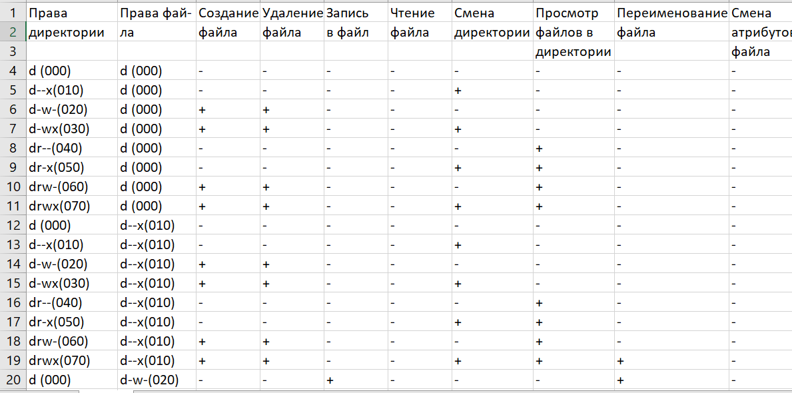
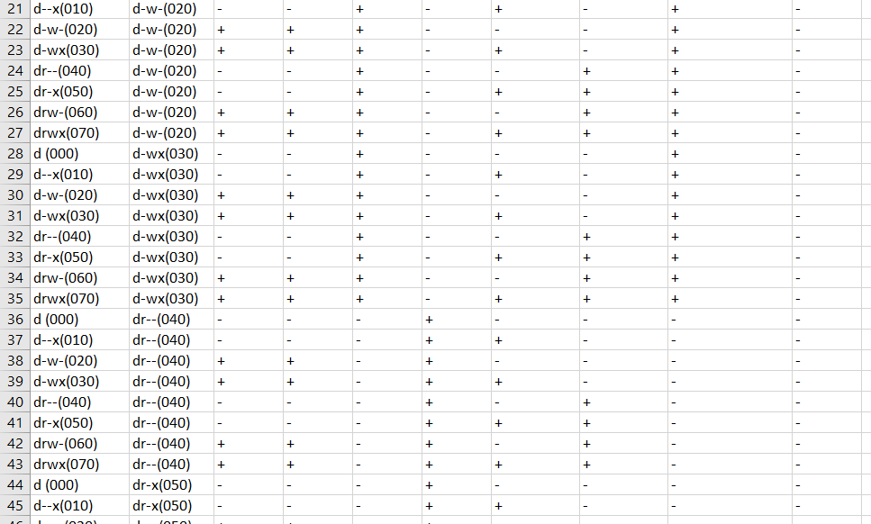

---
## Front matter
lang: ru-RU
title: Дискреционное разграничение прав в Linux. Основные атрибуты
author: Назарьева Алена НФИбд-03-18
institute:
	inst{1}RUDN University, Moscow, Russian Federation
date: 2021, 1 october
## Formatting
toc: false
slide_level: 2
theme: metropolis
mainfont: PT Serif
romanfont: PT Serif
sansfont: PT Sans
monofont: PT Mono
mainfontoptions: Ligatures=TeX
romanfontoptions: Ligatures=TeX
sansfontoptions: Ligatures=TeX,Scale=MatchLowercase
monofontoptions: Scale=MatchLowercase
header-includes:
 - \metroset{progressbar=frametitle,sectionpage=progressbar,numbering=fraction}
 - '\makeatletter'
 - '\beamer@ignorenonframefalse'
 - '\makeatother'
aspectratio: 43
section-titles: true
---
# Цель работы

Получение практических навыков работы в консоли с атрибутами файлов для групп пользователей

# Выполнение лабораторной работы

## 1)
В установленной при выполнении предыдущей лабораторной работы
операционной системе создала учётную запись пользователя guest
(использую учётную запись администратора):
useradd guest. Задала пароль для пользователя guest (использую учётную запись администратора):
passwd guest (рис. -@fig:001)

{ #fig:001 width=70% }

## 2)
Аналогично создала второго пользователя guest2. Добавила пользователя guest2 в группу guest: gpasswd -a guest2 guest
 (рис. -@fig:002)

{ #fig:002 width=70% }

## 3)
Для обоих пользователей командой pwd определила директорию, в которой вы находитесь. Сравнила её с приглашениями командной строки. Уточнила имя вашего пользователя, его группу, кто входит в неё
и к каким группам принадлежит он сам. Определила командами
groups guest и groups guest2, в какие группы входят пользователи guest и guest2. Сравнила вывод команды groups с выводом команд id -Gn и id -G.  (рис. -@fig:003)

{ #fig:003 width=70% }

## 4)
Просмотрите файл командой
cat /etc/group. От имени пользователя guest2 выполнила регистрацию пользователя
guest2 в группе guest командой newgrp guest(рис. -@fig:004)

{ #fig:004 width=70% }

## 5)
От имени пользователя guest измените права директории /home/guest,
разрешив все действия для пользователей группы:
chmod g+rwx /home/guest. От имени пользователя guest сняла с директории /home/guest/dir1
все атрибуты командой chmod 000 dirl и проверила правильность снятия атрибутов.
(рис. -@fig:005)

{ #fig:005 width=70% }

## 6)
Меняя атрибуты у директории dir1 и файла file1 от имени пользователя guest и делая проверку от пользователя guest2, заполнила табл. 3.1, определив опытным путём, какие операции разрешены, а какие нет. Если операция разрешена, занесла в таблицу знак «+», если не разрешена, знак «-». (рис. -@fig:006)

{ #fig:006 width=70% }

## 7)
(рис. -@fig:007)

{ #fig:007 width=70% }

## 8)
(рис. -@fig:008)

{ #fig:008 width=70% }

## 9)

Сравнила табл. 2.1 (из лабораторной работы № 2) и табл. 3.1. Таблицы совпадают по всем столбцам,кроме последнего "Смена атрибутов файла" На основании заполненной таблицы определила
те или иные минимально необходимые права для выполнения пользователем guest2 операций внутри директории dir1 и заполнила табл. 3.2 (рис. -@fig:009)

{ #fig:009 width=70% }

# Выводы

В результате проделанной работы я Получила практические навыки работы в консоли с атрибутами файлов для групп пользователей
