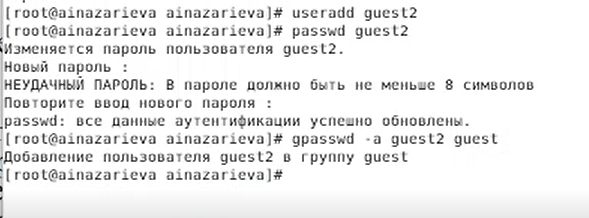

---
# Front matter
lang: ru-RU
title: "Oтчёт по лабораторной работе"
subtitle: "Дискреционное разграничение прав в Linux. Два пользователя"
author: "Назарьева Алена Игоревна НФИбд-03-18"

# Formatting
toc-title: "Содержание"
toc: true # Table of contents
toc_depth: 2
lof: true # List of figures
lot: true # List of tables
fontsize: 12pt
linestretch: 1.5
papersize: a4paper
documentclass: scrreprt
polyglossia-lang: russian
polyglossia-otherlangs: english
mainfont: PT Serif
romanfont: PT Serif
sansfont: PT Sans
monofont: PT Mono
mainfontoptions: Ligatures=TeX
romanfontoptions: Ligatures=TeX
sansfontoptions: Ligatures=TeX,Scale=MatchLowercase
monofontoptions: Scale=MatchLowercase
indent: true
pdf-engine: lualatex
header-includes:
  - \linepenalty=10 # the penalty added to the badness of each line within a paragraph (no associated penalty node) Increasing the value makes tex try to have fewer lines in the paragraph.
  - \interlinepenalty=0 # value of the penalty (node) added after each line of a paragraph.
  - \hyphenpenalty=50 # the penalty for line breaking at an automatically inserted hyphen
  - \exhyphenpenalty=50 # the penalty for line breaking at an explicit hyphen
  - \binoppenalty=700 # the penalty for breaking a line at a binary operator
  - \relpenalty=500 # the penalty for breaking a line at a relation
  - \clubpenalty=150 # extra penalty for breaking after first line of a paragraph
  - \widowpenalty=150 # extra penalty for breaking before last line of a paragraph
  - \displaywidowpenalty=50 # extra penalty for breaking before last line before a display math
  - \brokenpenalty=100 # extra penalty for page breaking after a hyphenated line
  - \predisplaypenalty=10000 # penalty for breaking before a display
  - \postdisplaypenalty=0 # penalty for breaking after a display
  - \floatingpenalty = 20000 # penalty for splitting an insertion (can only be split footnote in standard LaTeX)
  - \raggedbottom # or \flushbottom
  - \usepackage{float} # keep figures where there are in the text
  - \floatplacement{figure}{H} # keep figures where there are in the text
---

# Цель работы

Получение практических навыков работы в консоли с атрибутами файлов для групп пользователей

# Выполнение лабораторной работы

1. В установленной при выполнении предыдущей лабораторной работы
операционной системе создала учётную запись пользователя guest
(использую учётную запись администратора):
useradd guest

2. Задала пароль для пользователя guest (использую учётную
   запись администратора):
passwd guest (рис. -@fig:001)

{ #fig:001 width=70% }

3. Аналогично создала второго пользователя guest2.
4. Добавила пользователя guest2 в группу guest: gpasswd -a guest2 guest
 (рис. -@fig:002)

{ #fig:002 width=70% }

5. Осуществила вход в систему от двух пользователей на двух разных консолях: guest на первой консоли и guest2 на второй консоли.
6. Для обоих пользователей командой pwd определила директорию, в которой вы находитесь. Сравнила её с приглашениями командной строки.
7. Уточнила имя вашего пользователя, его группу, кто входит в неё
и к каким группам принадлежит он сам. Определила командами
groups guest и groups guest2, в какие группы входят пользователи guest и guest2. Сравнила вывод команды groups с выводом команд
id -Gn и id -G.  (рис. -@fig:003)

{ #fig:003 width=70% }

8. Сравнила полученную информацию с содержимым файла /etc/group.
Просмотрите файл командой
cat /etc/group
9. От имени пользователя guest2 выполнила регистрацию пользователя
guest2 в группе guest командой
newgrp guest(рис. -@fig:004)

{ #fig:004 width=70% }

10. От имени пользователя guest измените права директории /home/guest,
разрешив все действия для пользователей группы:
chmod g+rwx /home/guest
11. От имени пользователя guest сняла с директории /home/guest/dir1
все атрибуты командой
chmod 000 dirl
и проверила правильность снятия атрибутов.
(рис. -@fig:005)

{ #fig:005 width=70% }

Меняя атрибуты у директории dir1 и файла file1 от имени пользователя guest и делая проверку от пользователя guest2, заполнила табл. 3.1,
определив опытным путём, какие операции разрешены, а какие нет. Если операция разрешена, занесла в таблицу знак «+», если не разрешена, знак «-».
(рис. -@fig:006)

{ #fig:006 width=70% }

(рис. -@fig:007)

{ #fig:007 width=70% }

(рис. -@fig:008)

{ #fig:008 width=70% }

Сравнила табл. 2.1 (из лабораторной работы № 2) и табл. 3.1. Таблицы совпадают по всем столбцам,кроме последнего "Смена атрибутов файла"
На основании заполненной таблицы определила те или иные минимально необходимые права для выполнения пользователем guest2 операций
внутри директории dir1 и заполнила табл. 3.2 (рис. -@fig:009)

{ #fig:009 width=70% }

# Выводы

В результате проделанной работы я Получила практические навыки работы в консоли с атрибутами файлов для групп пользователей
